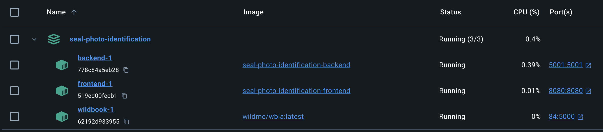

# Seal Photo-Identification

## Overview

Welcome to **Sealcentre Photo-Identification**! The current project aims to create an application that performs photo-comparison and matching of seals for the researchs in the [Sealcentre Pieterburen](https://www.visitgroningen.nl/en/things-to-do/groningen-for-kids/sealcentre-pieterburen). For that, we are using WildBook AI, Docker, Python and SQLite. This README will guide you through the setup process and provide an overview of the project structure and functionality.

## Requirements

- Python (version 3.9)
- [Poetry](https://python-poetry.org/)
- [Docker](https://www.docker.com/)
- [WildBook AI](https://github.com/WildMeOrg/wildbook-ia)

## How to Run

With Docker Desktop running, the first step is to download WildBook's Image. The WBIA software is built and deployed as a Docker image wildme/wbia. After git cloning this repository, insert your existing WildBook Database in the root directory. Then, execute the follow command on the main directory to build the application container:
```
docker-compose up -d --build
```

After docker installs the images and prepares the containers, the container's tab should look like this:


Ready! You can start using the web app in ```localhost:8080```.
